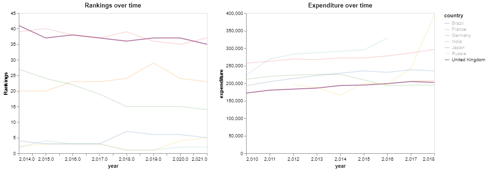

University Rankings Analysis
==============================

The aim was to analyse the relationship between government spending on tertiary education and  the rankings of that country's universities

Rankings data was obtained from the [Center for World University Rankings](https://cwur.org/) and the spending data from the [UNESCO Institute for Statistics](http://data.uis.unesco.org/#)

The project contains a jupyter notebook which includes the data preprocessing and visualisations. Libraries used were matplotlib, plotly express and altair

                                               
                                                                          
